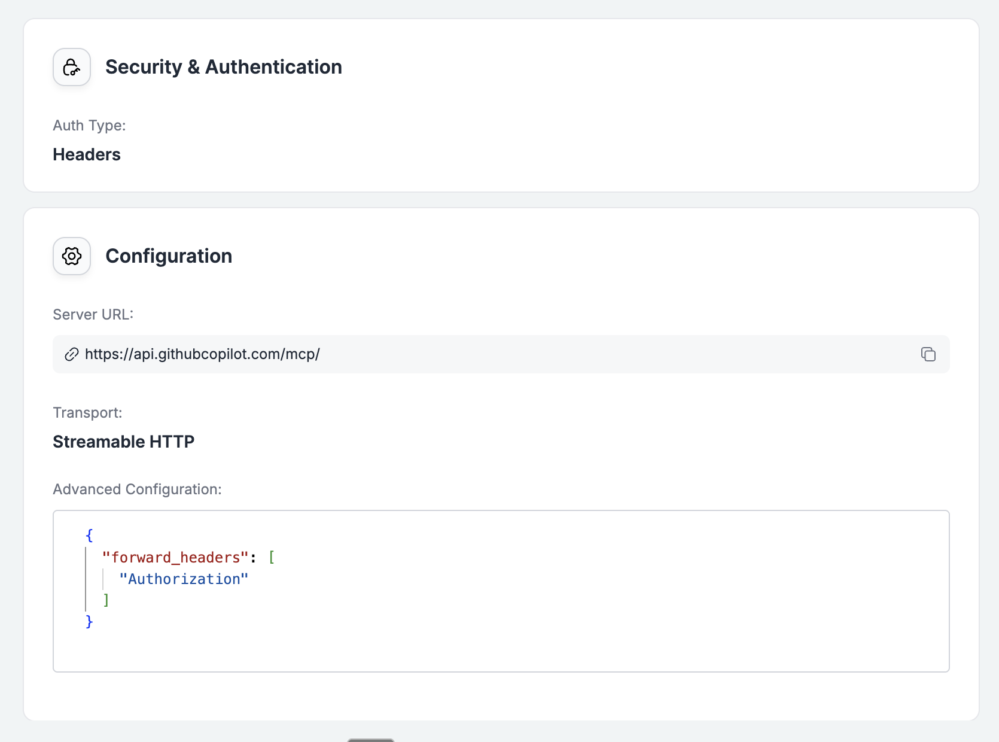
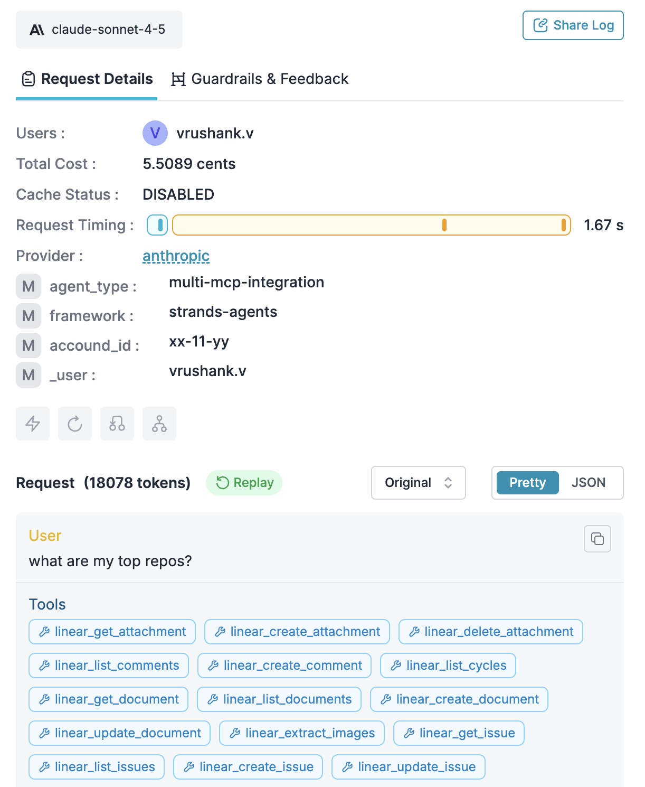
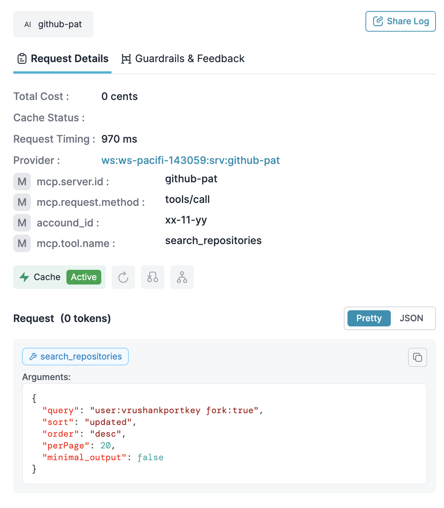

# 🧶 Strands Agents × Portkey MCP Integration

This project demonstrates how to build production-ready **Strands Agents** that leverage **Portkey** for observability, reliability, and secure access to **Model Context Protocol (MCP)** servers.

It features a multi-tool agent capable of interacting with:
- **Linear**: Managing issues and teams (via Portkey MCP)
- **GitHub**: Searching repos and code (via Portkey MCP with Header Forwarding)
- **LLMs**: Accessing Anthropic Claude Sonnet 3.5 (via Portkey Gateway)

---

## 🚀 Key Features

### 1. Unified Authentication with `forwardHeaders`
The implementation showcases Portkey's powerful **Header Forwarding** capability for MCP servers. 

Instead of managing separate connections, the agent connects to a single Portkey endpoint. Portkey transparently handles the authentication:
- **Linear Auth**: Managed natively by Portkey's MCP registry.
- **GitHub Auth**: The agent sends the GitHub PAT in the `Authorization` header. Portkey's Gateway is configured to **forward this header** securely to the upstream GitHub MCP server.


*Configuration in Portkey showing the `forwardHeaders` setup for the GitHub MCP server.*

### 2. Full Observability
Every step of the agent's execution—including LLM reasoning and MCP tool calls—is traced in Portkey.


*Portkey trace showing the agent deciding to call the GitHub tool.*


*Detailed view of the specific MCP tool execution and response.*

---

## 🛠️ Setup & Usage

### Prerequisites
- Python 3.13+
- [uv](https://github.com/astral-sh/uv) (for dependency management)
- A **Portkey API Key**
- A **GitHub Personal Access Token (PAT)**

### Installation

```bash
uv sync
```

### Configuration

Set the required environment variables:

```bash
# Your Portkey API Key (routes to LLMs + Linear MCP)
export PORTKEY_API_KEY="your-portkey-api-key"

# Linear MCP Server URL (hosted on Portkey)
export LINEAR_MCP_URL="https://mcp.portkey.ai/linear/mcp"

# Your GitHub Token (forwarded by Portkey to GitHub MCP)
export GITHUB_PAT="ghp_..."

# GitHub MCP Server URL (hosted on Portkey)
export GITHUB_MCP_URL="https://mcp.portkey.ai/github-pat/mcp"
```

### Running the Agent

Launch the interactive agent session:

```bash
uv run main.py
```

The agent will initialize and connect to both services:

```text
🔮 Initializing Strands Agent...
  • Loading dependencies...
  • Connecting to Portkey Gateway...
  • Connecting to Linear MCP...
  • Connecting to GitHub MCP...
  ✅ Ready!
```

---

## 🔍 How It Works

### Code Example

The integration is seamless using `streamablehttp_client`. notice the difference between standard Portkey Auth (Linear) and Header Forwarding (GitHub):

```python
# Linear MCP Connection (Standard Portkey Auth)
def create_linear_mcp_transport():
    return streamablehttp_client(
        url=LINEAR_MCP_URL,
        headers={
            "x-portkey-api-key": PORTKEY_API_KEY
        }
    )

# GitHub MCP Connection (With Header Forwarding)
def create_github_mcp_transport():
    return streamablehttp_client(
        url=GITHUB_MCP_URL,
        headers={
            # Portkey Authentication
            "x-portkey-api-key": PORTKEY_API_KEY,
            
            # Forwarded to GitHub MCP by Portkey
            "Authorization": f"Bearer {GITHUB_PAT}"
        }
    )
```

### Architecture

1. **Agent** → Sends request to **Portkey Gateway**.
2. **Portkey Gateway** → 
   - Authenticates the request using `x-portkey-api-key`.
   - Identifies the target MCP server.
   - **Forwards** the `Authorization` header (containing the GitHub PAT) to the upstream MCP server.
3. **GitHub MCP** → Receives the PAT and authenticates with GitHub API.

This design keeps your client code clean while ensuring securely managed access to your diverse tool ecosystem.
